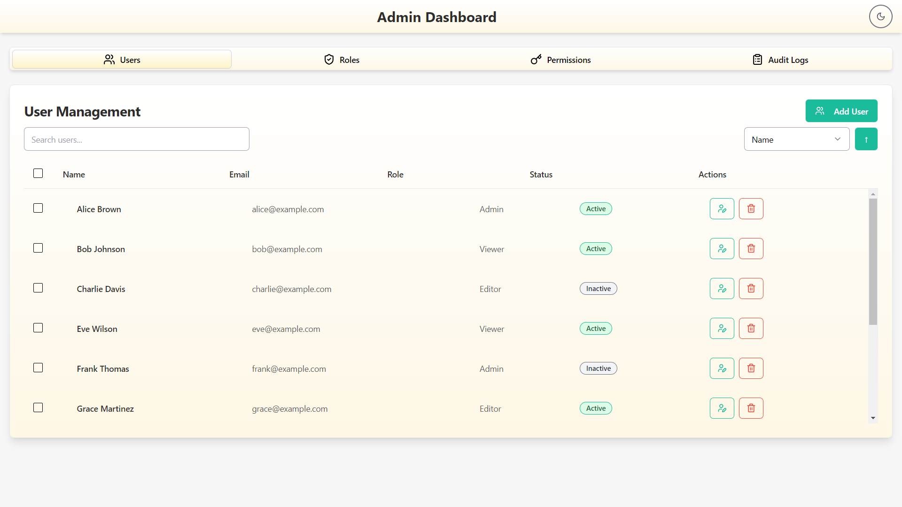
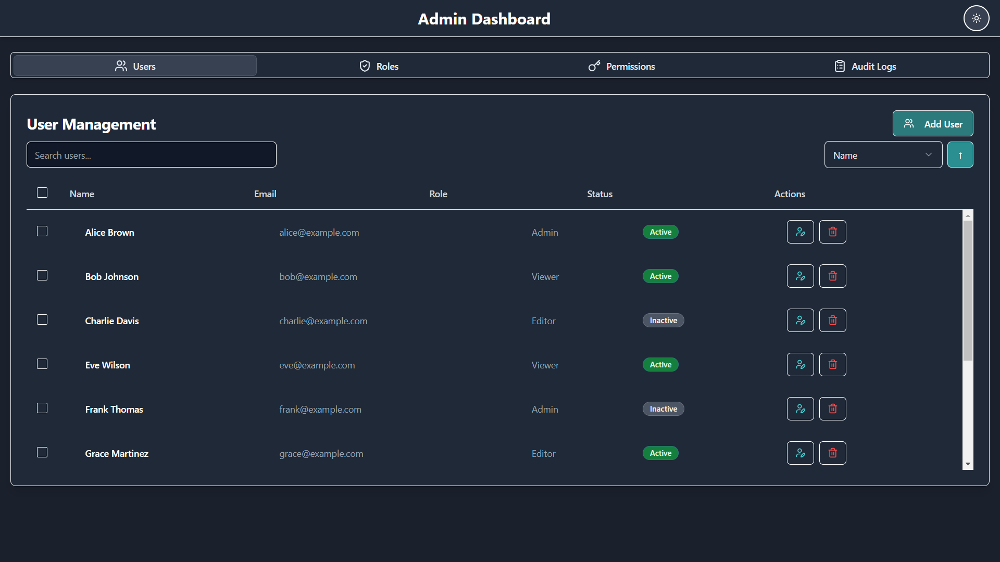
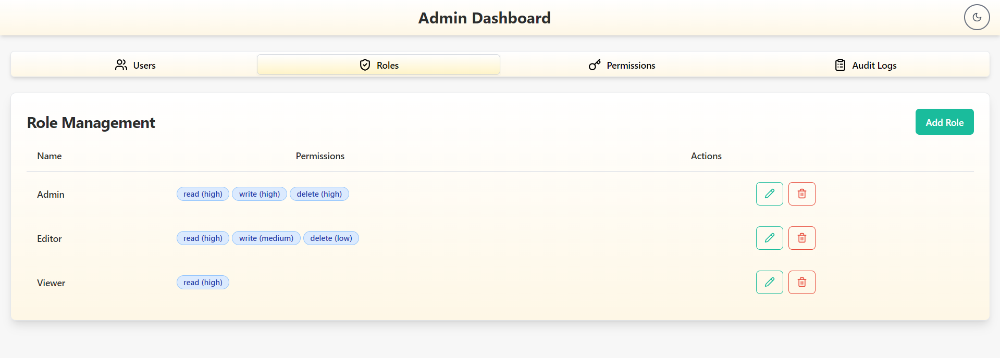
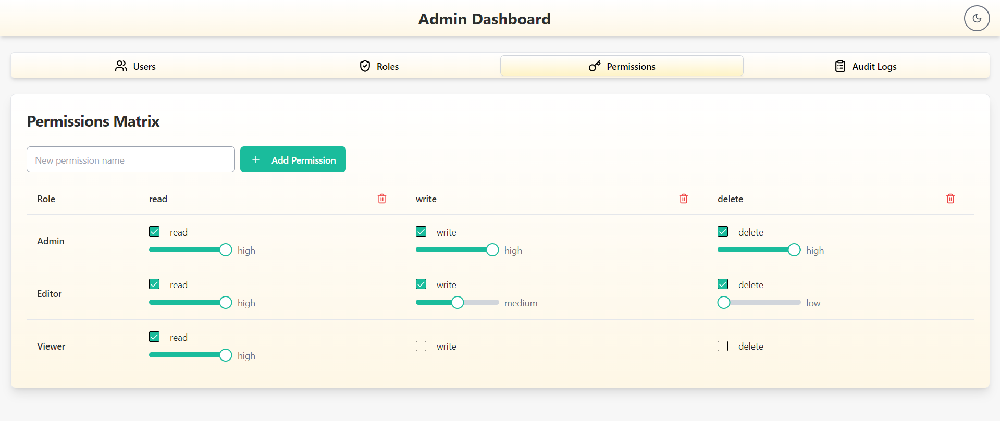
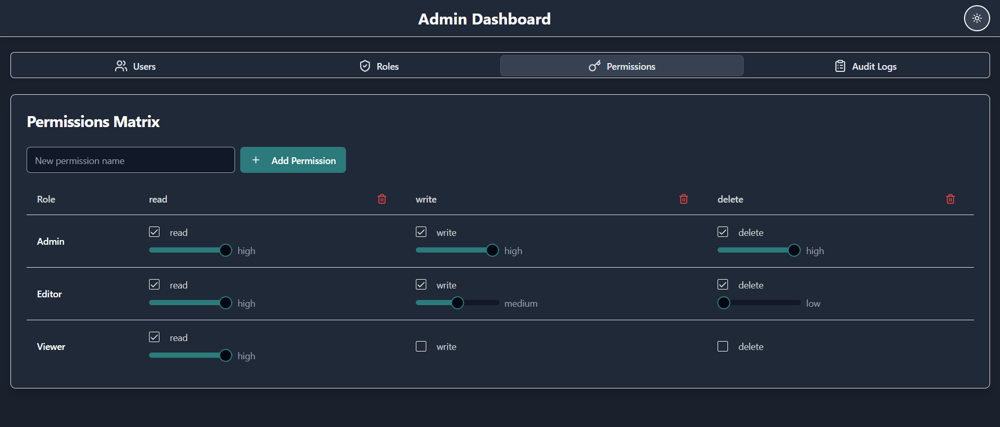
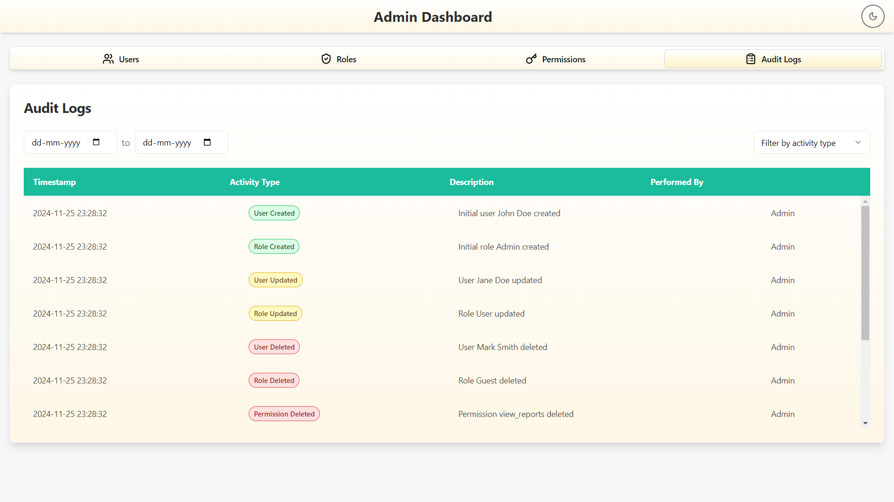
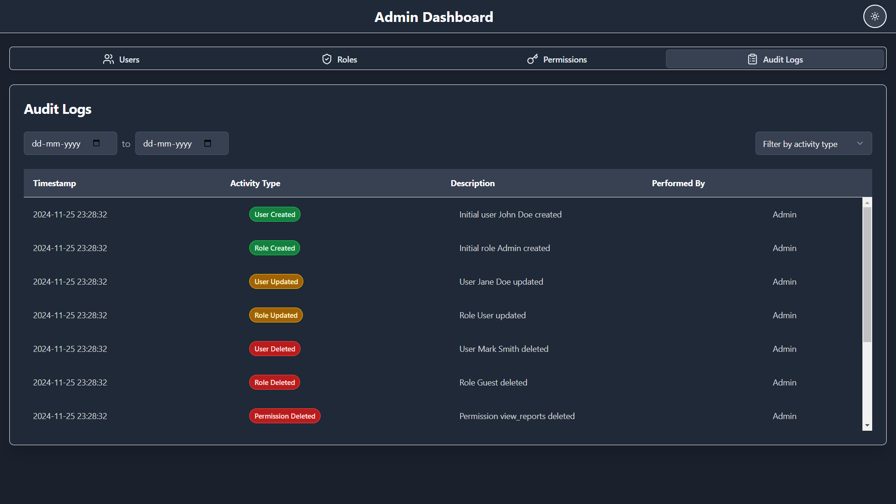

# 🌟 Role-Based Access Control (RBAC) Admin Dashboard  

This project is a feature-rich **Role-Based Access Control (RBAC) Admin Dashboard** that I developed using **Next.js**, **TypeScript**, **Tailwind CSS**, and **ShadCN UI components**. The dashboard incorporates **rich animations** for a smooth and interactive user experience, along with functionalities like **User Management**, **Role Management**, **Permissions Control**, **Audit Logs Tracking**, and a **Dark Mode Toggler** for enhanced accessibility.

---

## 🌐 Live Demo  

You can view the live project here:  
**[RBAC Admin Dashboard - Live Demo](https://rbac-admin-dashboard.netlify.app/)**  

---


## 🚀 Features  

### 👤 **User Management**  
Manage users efficiently with an intuitive interface:  
- **View and Filter Users**: Quickly navigate through a list of users with robust search and filtering capabilities.  
- **Edit and Delete Users**: Modify user details or remove users from the system.  
- **Real-Time UI Updates**: Changes are instantly reflected for a seamless experience.  
- **Role Assignment**: Assign specific roles to users based on their responsibilities.  
- **Bulk Actions**: Perform actions on multiple users simultaneously for efficiency.  

**Screenshots:**  
- **Light Mode**:  
    
- **Dark Mode**:  
    

---

### 🛡️ **Role Management**  
Define and manage roles to control access within the application:  
- **Role Creation**: Create roles with specific permissions tailored to organizational needs.  
- **Edit and Update Roles**: Modify existing roles as requirements evolve.  
- **Permissions Matrix**: Visualize and assign granular permissions to roles.  
- **Assign Roles**: Assign or modify roles for users to manage access control.  

**Screenshots:**  
- **Light Mode**:  
    
- **Dark Mode**:  
    

---

### 🔐 **Permissions**  
Fine-grained permissions management for enhanced security:  
- **Custom Permission Sets**: Configure permissions at a granular level for specific roles.  
- **Dynamic Updates**: Instantly apply permission changes without disrupting workflows.  
- **Preview Mode**: Test role permissions before finalizing changes.  

**Screenshots:**  
- **Light Mode**:  
    
- **Dark Mode**:  
    

---

### 📝 **Audit Logs**  
Track all activities within the system for better accountability:  
- **Activity Tracking**: Monitor changes like user creation, deletion, and updates.  
- **Advanced Filters**: Filter logs by date, activity type, or user for focused analysis.  
- **Export Logs**: Export audit logs for compliance and reporting.  
- **Detailed View**: Drill down into individual log entries for comprehensive insights.  

**Screenshots:**  
- **Light Mode**:  
    
- **Dark Mode**:  
    

---

## 🪄 Rich Animations  

I have leveraged Framer Motion to incorporate rich animations into the user interface:
- **Page Transitions**: Smooth transitions between pages for a polished look.  
- **Interactive Components**: Animated dropdowns, modals, and tooltips.  
- **Hover Effects**: Dynamic hover animations for buttons and links.  
- **Theme Switching**: Fluid transitions during dark mode toggling.  

Animations enhance the user experience by making interactions more intuitive and enjoyable.  

---

## 💻 Technology Stack  

| Technology             | Description                                        |
|------------------------|----------------------------------------------------|  
| **Next.js**            | Frontend framework for React                       |  
| **Tailwind CSS**       | Utility-first CSS framework                        |   
| **ShadCN UI**          | Accessible and reusable UI components              |   
| **TypeScript**         | Static typing for JavaScript                       |   
| **Framer Motion**      | Animation library for React                        |  

---

## 🛠️ Installation  

### Prerequisites  
- Node.js (>= 16.x)  
- npm or yarn  

### Steps  
1. Clone the repository:  
   ```bash  
   git clone https://github.com/kaushik-kadari/Role-Based-Access-Control-Admin-Dashboard.git  
   cd Role-Based-Access-Control-Admin-Dashboard
   ```  

2. Install dependencies:  
   ```bash  
   npm install  
   # or  
   yarn install  
   ```  

3. Start the development server:  
   ```bash  
   npm run dev  
   # or  
   yarn dev  
   ```  

4. Open [http://localhost:3000](http://localhost:3000) in your browser to view the app.  

---

## 📁 Project Structure  

```plaintext  
src/  
├── components/             # Reusable React components  
│   ├── AuditLogs.tsx       # Component for displaying and filtering audit logs  
│   ├── Permissions.tsx     # Component for managing permissions  
│   ├── RoleManagement.tsx  # Component for managing roles  
│   ├── UserManagement.tsx  # Component for managing users  
│   ├── DarkModeToggler.tsx # Component for toggling dark mode  
│   ├── UI/                 # Common UI components (e.g., tables, buttons, forms)  
│       ├── Button.tsx      # Reusable button component  
│       ├── Table.tsx       # Table UI for displaying data  
├── hooks/                  # Custom React hooks  
│   ├── use-toast.ts        # Hook for managing toast notifications  
│   ├── useRoles.ts         # Hook for fetching and managing roles  
│   ├── useUsers.ts         # Hook for fetching and managing users  
├── pages/                  # Next.js pages  
│   ├── index.tsx           # Dashboard landing page  
│   ├── users.tsx           # User management page  
│   ├── roles.tsx           # Role management page  
│   ├── permissions.tsx     # Permissions page  
│   ├── logs.tsx            # Audit logs page  
├── styles/                 # Custom CSS or Tailwind styles  
│   ├── globals.css         # Global styles  
├── utils/                  # Utility functions and helpers  
│   ├── api.ts              # API utility functions for backend interaction  
│   ├── constants.ts        # Constants used across the project  
├── public/                 # Static assets  
│   ├── images/             # Placeholder for screenshots  
│       ├── user-management.png  
│       ├── role-management.png  
│       ├── audit-logs.png  
│       ├── permissions.png    
├── tailwind.config.js      # Tailwind CSS configuration  
├── tsconfig.json           # TypeScript configuration  
```  

---

## 🌐 Deployment  

1. Build the project:  
   ```bash  
   npm run build  
   ```  

2. Start the production server:  
   ```bash  
   npm run start  
   ```  

For deployment, use platforms like **Vercel**, **Netlify**, or any other Node.js-compatible hosting provider.  

---

## 🤝 Contributing  

I welcome contributions! Please follow the standard GitHub **fork and pull request** process.  